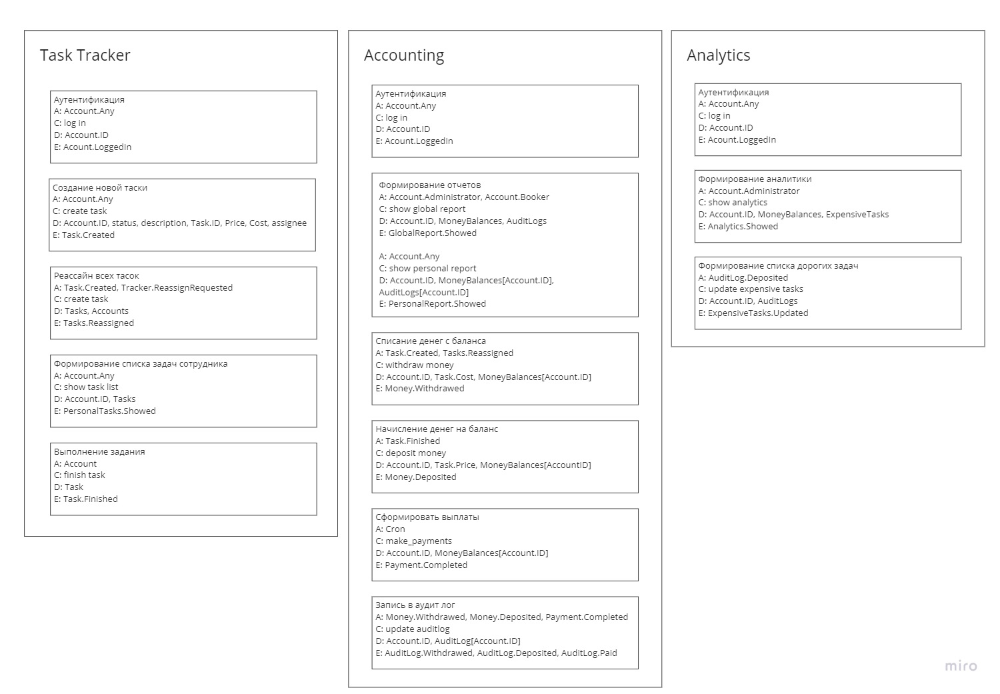
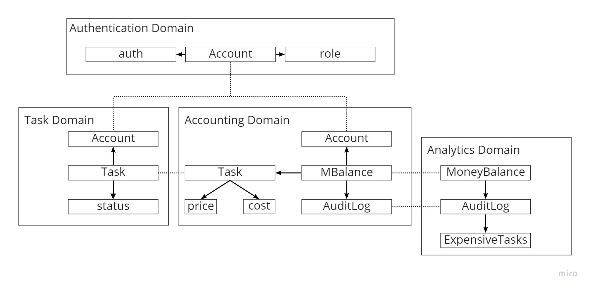

# AsyncArchitectire

## HW # 0
NotImplemented

## HW # 1

### Event Storming

### Domains

### Services & Communication

Эта часть была для меня самой сложной и неоднозначной. Создание и реассайн Task с одной стороны, являются бизнес-логикой, а с другой - CUD операциями. Поэтому предположил, что они и такие, и такие.
Также, внутри одного сервиса у меня получилось CUD взаимодействие меджу разными доменами. Это произошло, так как между этими доменами очень сильно пересечение по данным, и обновление данных в Accounting Domain : AuditLog ( источник правды о транзакциях) используется для обновления истории самых дорогих тасок в Analytics Domain : ExpensiveTasks.
Возможно, Analytics Domain : ExpensiveTasks как сущность не нужна вообще, но мне она показалась нужной и удобной, чтобы не делать перерасачеты по истории Accounting Domain : AuditLog на лету при запросе аналитики.

## HW # 2

Не успел полностью сделать домашку, планирую доделывать по ходу. С веб-стеком почти не сталкивался, поэтому учусь на ходу и вместо использования удобных фреймворков, о которых я не знаю, приходится писать что-то на коленке.
---
Что сделано:
* Написан сервис аутентификации (на коленке, с костылями). Пользователи храняться в базе, на отдельных эндпоинтах можно создавать \ модифицировать пользователей.
* Настроена отправка сообщений в RabbitMQ со стороны аутентификации при создании \ модификации пользователей.
* Настроено подтягивание в базу таск-трекера пользователей при получении уведомления из RabbitMQ.
* Написано создание тасок в таск-трекере с ассайном на подтянутых пользователей.

Понимаю, что нужно исправить:
* Сейчас использую SQLite - из-за этого не получается ходить из одного сервиса сразу в БД другого, сейчас это реализовано за счет эндпоинтов.
* Не сделана исходная синхронизация между БД сервисов: если в базе аутентификации были записи, то заново запущенный сервис таск-трекера не узнает о них.
* Аутентификация - г-но, точно можно лучше, но сейчас это, вроде, не цель.
* Код в целом попахивает, но чистить планирую уже после курса. Если читать совсем сложно - напиши, пожалуйста, постараюсь почистить раньше.

## HW # 3

В этот раз успел еще меньше, чем в прошлый:
* сделал schema_registry в виде библиотеки, которая ложится в корень к каждому сервису
* Обновил события в Auth & Tracker доменах, а также впилил их валидацию
* Начал писать Accounting: готовы модели данных, бОльшая часть CRUD операций и часть методов, реагирующих на входящие события.

## HW # 3

Закончил домашку: все сервисы имплементированы, схемы хранятся в отдельной "библиотеке".
