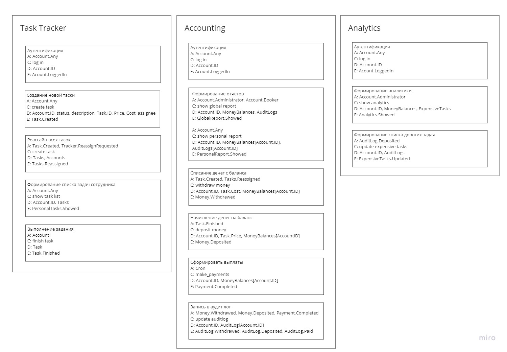
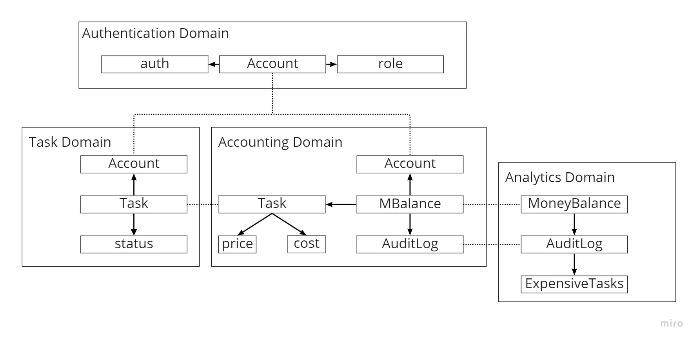

# AsyncArchitectire

## HW # 0
NotImplemented

## HW # 1

### Event Storming

### Domains

### Services & Communication

Эта часть была для меня самой сложной и неоднозначной. Создание и реассайн Task с одной стороны, являются бизнес-логикой, а с другой - CUD операциями. Поэтому предположил, что они и такие, и такие.
Также, внутри одного сервиса у меня получилось CUD взаимодействие меджу разными доменами. Это произошло, так как между этими доменами очень сильно пересечение по данным, и обновление данных в Accounting Domain : AuditLog ( источник правды о транзакциях) используется для обновления истории самых дорогих тасок в Analytics Domain : ExpensiveTasks.
Возможно, Analytics Domain : ExpensiveTasks как сущность не нужна вообще, но мне она показалась нужной и удобной, чтобы не делать перерасачеты по истории Accounting Domain : AuditLog на лету при запросе аналитики.

